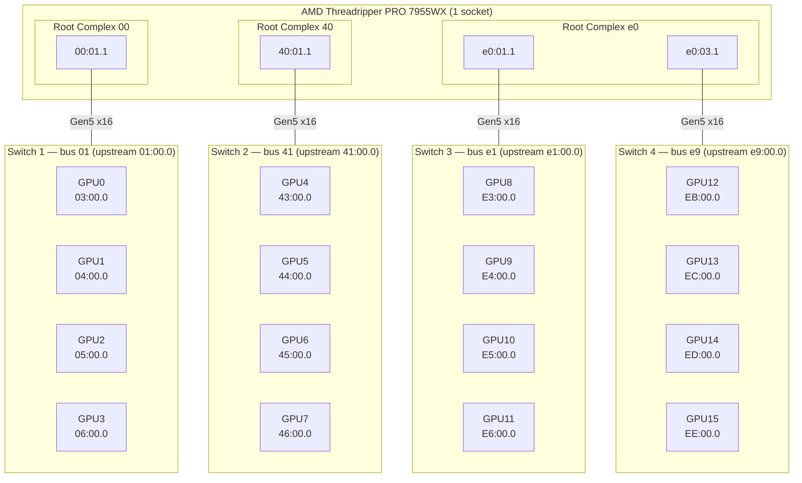

# ASRock WRX90 WS EVO — 16 GPUs with 4× c-payne Switches

PCIe topology analysis and P2P benchmarks for a 16× RTX PRO 6000 Blackwell build on ASRock WRX90 WS EVO using **4 c-payne Microchip Switchtec Gen5 switches** (each hosting 4 GPUs). This page extends the 2-switch and 3-switch topology analyses with full 16-GPU measurements.

Related pages: [WRX90 3-switch hierarchy](wrx90-cpayne-microchip-switches.md), [WRX90 2-switch flat](wrx90-cpayne-2switch-flat.md).

## Table of Contents

- [System Overview](#system-overview)
- [Physical PCIe Topology](#physical-pcie-topology)
- [P2P Bandwidth Results](#p2p-bandwidth-results)
- [P2P Latency Results](#p2p-latency-results)
- [p2pmark Benchmark Results](#p2pmark-benchmark-results)
- [Multi-Flow Scaling](#multi-flow-scaling)
- [Posted-Write Collapse on c-payne](#posted-write-collapse-on-c-payne)
- [Uplink Degradation Proof](#uplink-degradation-proof)
- [Comparison with Other Topologies](#comparison-with-other-topologies)
- [Hardware Notes](#hardware-notes)

---

## System Overview

| Component | Detail |
|---|---|
| **Motherboard** | ASRock WRX90 WS EVO |
| **CPU** | AMD Ryzen Threadripper PRO 7955WX 16-Core (1 socket) |
| **NUMA** | 1 node, but 3 distinct CPU root complexes |
| **RAM** | 256 GB DDR5-5600 |
| **GPUs** | 16× NVIDIA RTX PRO 6000 Blackwell (mix of Workstation + Server editions) |
| **PCIe Switches** | 4× c-payne Microchip Switchtec Gen5 (1f18:0101), 4 GPUs per switch |
| **Topology** | Flat — 4 independent switches across 3 root complexes |
| **Kernel** | 6.17.0-19-generic |
| **Driver** | NVIDIA 595.45.04 (open) |
| **CUDA** | 13.2 |

---

## Physical PCIe Topology

Four switches with 4 GPUs each. Two switches (SW3, SW4) share one CPU root complex (`e0`) and show up as **PHB** in nvidia-smi topo. Switches SW1 and SW2 have their own separate root complexes (`00` and `40`).



### nvidia-smi Topology (abbreviated)

```
        GPU0-3  GPU4-7  GPU8-11  GPU12-15
GPU0-3   PIX    NODE    NODE     NODE
GPU4-7   NODE   PIX     NODE     NODE
GPU8-11  NODE   NODE    PIX      PHB       ← same root cplx e0
GPU12-15 NODE   NODE    PHB      PIX
```

- **PIX** = same switch (1 hop)
- **PHB** = same CPU root complex but different switch (SW3↔SW4)
- **NODE** = different CPU root complex (crosses CPU-internal fabric)

### Key Architecture Detail

Unlike the 3-switch hierarchy (where a root switch connects leaf switches), this **4-switch flat** topology routes all cross-switch traffic **through the CPU**. SW3↔SW4 traffic uses the same root complex but still goes through CPU internals.

---

## P2P Bandwidth Results

### Bandwidth by Tier (representative samples, CUDA `cudaMemcpy` P2P write)

| Tier | Avg BW | Min–Max | Samples |
|---|---|---|---|
| **PIX** (same switch) | **53.2 GB/s** | 52.1–54.2 | 16 |
| **PHB** (same root cplx, diff switch) | **53.1 GB/s** | 52.5–53.8 | 8 |
| **NODE** (cross root complex) | **52.8 GB/s** | 52.2–53.6 | 16 |

All tiers are **~53 GB/s** — bandwidth is almost uniform. The difference between PIX and NODE is only 0.4 GB/s. Single-flow bandwidth does not reveal the topology.

### Per-GPU Bandwidth (GB/s, representative)

```
PIX  (GPU0↔GPU1 same switch 1):      52.5–54.2
PHB  (GPU8↔GPU12 same root e0):      53.1–53.8
NODE (GPU0↔GPU4 root 00→40):         52.5–53.6
NODE (GPU0↔GPU8 root 00→e0):         52.2–54.1
NODE (GPU0↔GPU12 root 00→e0 sw4):    52.4–53.3
```

> **Note:** With 16 GPUs, CUDA's `cudaDeviceEnablePeerAccess` hits the **peer mapping limit (8 peers/GPU)**. Full 16×16 matrix cannot be measured in a single process — each pair must enable/disable P2P individually. NCCL bypasses this via IPC handles.

---

## P2P Latency Results

Measured with p2pmark (128-byte remote reads, 10000 iterations). Tested in 8-GPU subsets due to peer limit.

### 4 GPU (Same Switch — SW1)

```
 Src->  GPU0   GPU1   GPU2   GPU3
GPU0:    —    0.80   0.80   0.80
GPU1:   0.79    —    0.80   0.80
GPU2:   0.77  0.77    —    0.78
GPU3:   0.79  0.78   0.78    —
```

- Min latency: **0.77 µs**
- Effective under concurrent load: **1.98 µs**

### 8 GPU (SW1 + SW2, cross root complex)

```
PIX (same switch):  0.72–0.80 µs
NODE (cross-root):  1.40–1.63 µs
```

- Min latency: **0.72 µs**
- Under full concurrent load (56 streams): **7.43 µs**

---

## p2pmark Benchmark Results

### 8 GPU — SW1 + SW2 (cross root complex 00↔40)

| Metric | Value |
|---|---|
| PCIe Link Score | **0.86** (54.17 GB/s avg) |
| Interconnect Score | **0.38** (162.82 / 433.39 GB/s) |
| Effective latency | 7.43 µs |

### 8 GPU — SW3 + SW4 (same root complex e0)

| Metric | Value |
|---|---|
| PCIe Link Score | **0.86** (54.28 GB/s avg) |
| Interconnect Score | **0.38** (165.92 / 434.28 GB/s) |

**Interesting:** Scores are nearly identical regardless of whether switches share a root complex (PHB) or not (NODE). The CPU routes both cases similarly.

### 8-GPU Topology Probe (staggered distance)

```
+1: 50.18 GB/s avg — neighbors (same switch)
+2: 38.00 GB/s avg
+3: 25.71 GB/s avg
+4: 12.59 GB/s avg — max distance (opposite switch)
+5: 25.66 GB/s avg
+6: 37.87 GB/s avg
+7: 50.03 GB/s avg — wrapping neighbors
```

The +4 probe at **12.6 GB/s** matches the 2-switch flat result — confirming that cross-switch traffic is bottlenecked by a single x16 uplink through the CPU.

---

## Multi-Flow Scaling

| Flows | Config | Total BW | Per-flow |
|---|---|---|---|
| 1 | PIX (same switch) | 52.5 GB/s | 52.5 |
| 2 | PIX (same switch) | 105.7 GB/s | 52.9 |
| 1 | NODE (cross root cplx) | 52.5 GB/s | 52.5 |
| 2 | NODE (same src sw → same dst sw) | 53.2 GB/s | **26.6** |
| 2 | NODE (same src sw) | 53.1 GB/s | **26.5** |
| 4 | NODE 1:1 SW1→SW2 | 53.7 GB/s | **13.4** |
| 4 | NODE, dst across 3 switches | **19.2 GB/s** | **4.8** |
| 4 | PHB 1:1 SW3→SW4 (same root e0) | **54.4 GB/s** | 13.6 |
| 16 | SW1→SW2 all pairs | 51.9 GB/s | 3.2 |

**Key observation:** Cross-switch bandwidth is limited to ~53 GB/s total regardless of flow count — all cross-switch traffic from one switch competes for the single x16 uplink. The "4 flows across 3 switches" test (19.2 GB/s) is dramatically worse than other configs because of the posted-write collapse pattern (see below).

### GPU DS Port Isolation

| Test | Total BW | Notes |
|---|---|---|
| Same GPU: GPU0→GPU4 + GPU0→GPU2 | 52.5 GB/s | DS port shared |
| Diff GPU: GPU0→GPU4 + GPU1→GPU2 | ~105 GB/s | Independent (scales) |

---

## Posted-Write Collapse on c-payne

**Finding:** Unlike 2-switch and 3-switch c-payne topologies, the **4-switch setup DOES exhibit posted-write collapse** — same as the Broadcom PEX890xx bug documented in [the ASUS ESC8000A-E13P analysis](asus-esc8000a-e13p-broadcom-switches.md#pex890xx-posted-write-arbitration-bug).

### Trigger

Two or more GPUs on the **same source switch** sending posted writes through a shared uplink to destinations behind **two or more different CPU root complexes**.

### Test Results

| Scenario | Write BW | Read BW | Status |
|---|---|---|---|
| SW1→SW3+SW4 (same dst root e0) | **53.4** | 57.5 | OK |
| SW2→SW3+SW4 (same dst root e0) | **55.3** | 54.1 | OK |
| SW1→SW2(root40) + SW3(root e0) | **11.6** | 52.9 | **COLLAPSE** |
| SW1→SW2(root40) + SW4(root e0) | **13.3** | 53.8 | **COLLAPSE** |
| SW1→SW3(root e0) + SW2(root 40) | **12.5** | 57.0 | **COLLAPSE** |
| SW1→SW2(root40) + SW4(root e0), variant src | **12.8** | 53.6 | **COLLAPSE** |
| SW1→SW2 only (1 dst root) | 54.1 | 54.7 | OK |
| SW1→SW3 only (1 dst root) | 56.0 | 53.0 | OK |
| SW1→SW2 + SW3→SW4 (diff src sw) | **106.8** | 105.6 | OK |

### Interpretation

The collapse requires **different destination CPU root complexes**, not just different destination switches:

- SW1→SW3+SW4 (both dst on root complex `e0`) → **OK** (no collapse)
- SW1→SW2+SW3 (dst on root `40` + root `e0`) → **COLLAPSE**

This indicates the bottleneck is on the **CPU side** (how root complexes handle incoming posted writes from a single source uplink targeting multiple destination root complexes), not on the switch side. It is the same Broadcom-style pattern, but only surfaces when 3+ root complexes are involved.

**Reads do not collapse** (53–57 GB/s in all cases) — confirming this is specific to posted write arbitration.

---

### Control measurement: 16-GPU 4-switch on only 2 root complexes

The collapse is determined by the **number of distinct root complexes touched by the dispatch pattern**, not by the switch topology shape per se. To isolate this we re-ran the EXACT same trigger patterns (same GPU index → switch mapping, same PyTorch test harness, same `iters=50` and `SIZE=256 MB`) on a rewired 16-GPU 4-switch setup where each pair of switches shares one root complex:

```
Original 4-switch wiring (this page's main results — collapse fires)
  SW1 → root 00 (Q0)         ← 4 distinct CPU root
  SW2 → root 40 (Q2)            complexes touched
  SW3 → root e0:01.1 (Q3)
  SW4 → root e0:03.1 (Q3)

Variant 4-switch wiring (re-test — only 2 distinct root complexes)
  SW1 → root 00 (Q0)         ← only 2 distinct CPU
  SW2 → root 00 (Q0)            root complexes total
  SW3 → root e0 (Q3)
  SW4 → root e0 (Q3)
```

Measured side-by-side on the same TR Pro 7955WX rig, same kernel, same NVIDIA driver:

| Pattern | Original wiring (4 roots) | Variant wiring (2 roots) | Δ |
|---------|--------------------------:|-------------------------:|---|
| SW1→SW3+SW4 (same dst root e0) | 53.4 W / 57.5 R — OK | 56.4 W / 56.4 R — OK | identical |
| SW2→SW3+SW4 (same dst root e0) | 55.3 W / 54.1 R — OK | 56.4 W / 56.4 R — OK | identical |
| **SW1→SW2+SW3** | **11.6 W / 52.9 R — COLLAPSE** | **56.4 W / 56.4 R — NO collapse** | **+44.8 GB/s WRITE** |
| **SW1→SW2+SW4** | **13.3 W / 53.8 R — COLLAPSE** | **56.4 W / 56.4 R — NO collapse** | **+43.1 GB/s WRITE** |
| SW1→SW2 only (1 dst root) | 54.1 / 54.7 — OK | 56.4 / 56.4 — OK | identical |
| SW1→SW3 only (1 dst root) | 56.0 / 53.0 — OK | 56.4 / 56.4 — OK | identical |
| SW1→SW2 + SW3→SW4 (different src) | 106.8 / 105.6 — OK | 112.5 / 112.5 — OK | identical |

The **two patterns that fire the collapse on the original wiring (~13 GB/s WRITE, ~75 % drop) cleanly saturate the source uplink at ~56 GB/s on the variant wiring** — no collapse signature, no write/read asymmetry.

The reason the trigger pattern does not fire on the variant: with only 2 root complexes (Q0 and Q3), the `SW1→SW2+SW3` dispatch translates to one **intra-quadrant** flow (SW1 to SW2, both on Q0) and one **cross-quadrant** flow (SW1 to SW3, Q0→Q3). The intra-quadrant flow does not exercise the inter-quadrant fabric arbiter, so the source switch is dispatching to **one** cross-quadrant destination, not two. The arbiter cannot misbehave because it is only arbitrating one inter-quadrant target.

### Updated trigger condition (more precise)

This control measurement refines the trigger condition documented in the previous section:

> **Old (imprecise):** "2 or more concurrent posted-write flows from one source switch to destinations on 2+ different CPU root complexes."
>
> **More precise:** "2 or more concurrent posted-write flows from one source switch to destinations on 2+ different **remote** CPU quadrants — i.e. quadrants that are *not* the source switch's own quadrant. The trigger requires **3+ distinct quadrants involved in total** (1 src + 2 dst, all different)."

In topologies where every PCIe switch has its own dedicated root complex (so each "different switch" implies "different root"), the old phrasing happens to give the right answer. In topologies where multiple switches share a root complex (current variant, or 8-GPU 2-VS-per-chip layouts), the old phrasing over-predicts collapse — only patterns that genuinely target ≥ 2 *non-source* quadrants concurrently will trip the IOD arbiter.

This is consistent with everything else we have measured on this rig:
- 8-GPU 2-VS-per-chip layouts (V1/V2/V3, see [`wrx90-cpayne-8gpu-2vs-per-chip.md`](wrx90-cpayne-8gpu-2vs-per-chip.md)) — 2 GPUs per source VS, max 1 cross-quadrant target at a time → no collapse on any variant.
- Original 16-GPU 4-switch with 4 separate root complexes → collapse fires (≥ 2 cross-quadrant targets reachable).
- Variant 16-GPU 4-switch with only 2 root complexes (this section) → no collapse (max 1 cross-quadrant target).

---

## Uplink Degradation Proof

Degrading SW1's root port uplink (00:01.1) to Gen2 proves cross-switch traffic goes through CPU root ports:

| Path | Baseline (Gen5) | Gen2 uplink | Uses uplink? |
|---|---|---|---|
| PIX GPU0→1 (same switch SW1) | 52.7 GB/s | **52.4 GB/s** (unchanged) | **NO** — stays in switch fabric |
| NODE GPU0→4 (cross root 00→40) | 52.4 GB/s | **7.0 GB/s** (Gen2 speed) | **YES** — through CPU uplink |

This confirms:
- Same-switch P2P is fabric-routed (does not touch CPU)
- Cross-switch P2P traverses CPU root port uplinks (bottlenecked at x16)

---

## Comparison with Other Topologies

| Metric | **16 GPU 4-switch** (this) | [8 GPU 3-switch hierarchy](wrx90-cpayne-microchip-switches.md) | [8 GPU 2-switch flat](wrx90-cpayne-2switch-flat.md) | [8 GPU Broadcom](asus-esc8000a-e13p-broadcom-switches.md) |
|---|---|---|---|---|
| **Same-switch BW** | 53.2 GB/s | 54.1 | 53.4 | 54 |
| **Cross-switch BW** | 52.8 GB/s | **54.2** (root switch) | 53.1 | 38 (same-chip 54) |
| **Cross-switch latency** | 1.40–1.63 µs | **1.14 µs** | 1.40 µs | 1.34 µs |
| **8-GPU all-to-all** | 162.8 GB/s | **196** | 162 | 52 |
| **Interconnect score** | 0.38 | **0.45** | 0.38 | 0.12 |
| **+4 distance probe** | 12.6 GB/s | **25.6** | 12.6 | 14.7 |
| **Posted-write collapse** | **YES** (3+ root cplx) | No | No | Yes (always) |
| **Cross uplink used** | Yes (CPU) | **No (root sw)** | Yes (CPU) | Yes (CPU) |
| **Scales to 16 GPU** | **Yes** | Needs bigger root sw | Needs more switches | Limited |

### Key Takeaway

On this 16-GPU + 4-switch flat setup:
- **Single-flow bandwidth is uniform** across all topology tiers (~53 GB/s) — same as 2-switch flat
- **Cross-switch traffic goes through CPU** — bottlenecked by x16 uplink per switch
- **Posted-write collapse appears** in certain multi-destination patterns involving 3+ root complexes — this did NOT occur on the 2-switch or 3-switch variants
- **The 3-switch hierarchy remains the best 8-GPU design** because its root switch routes cross-switch traffic fabric-to-fabric without CPU involvement

For 16 GPU, a hierarchical root-switch design (à la PM50100) would likely eliminate both the cross-switch uplink bottleneck AND the posted-write collapse. The flat 4-switch topology is simpler but inherits the Broadcom-style weakness.

---

## Hardware Notes

### ACS

All 24+ ACS-capable devices have `ReqRedir- CmpltRedir-`. No manual ACS disable needed on this system.

### PCIe Links

- All GPUs trained to **Gen5 x16** under load (32 GT/s)
- All 4 switch uplinks: Gen5 x16
- All switch downstream ports: Gen5 x16

### MaxReadReq

Same as other Microchip Switchtec configurations: switch ports hardcoded at 128 B (read-only), GPU/root ports at 512 B.

### Peer Mapping Limit

CUDA's `cudaDeviceEnablePeerAccess` has a limit of **8 peers per GPU** per process. With 16 GPUs, this prevents enabling full P2P mesh in a single process. Workarounds:

- **Enable P2P per-pair** as needed (used for these tests)
- **Use IPC handles** (`cudaIpcGetMemHandle`) — much higher limit
- **NCCL / NVSHMEM** handle this automatically via IPC

This is not a topology-specific limit — it affects any 9+ GPU CUDA workload.
