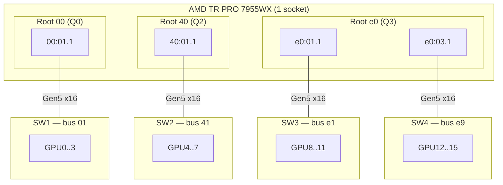

# ASRock WRX90 WS EVO — 16 GPUs with 4× c-payne Switches

PCIe topology analysis and P2P benchmarks for a 16× RTX PRO 6000 Blackwell build on ASRock WRX90 WS EVO using **4 c-payne Microchip Switchtec PM50100 Gen5 switches** (4 GPUs per switch).

The same hardware was tested with three different cabling variants — what changes between them is **only which CPU root complexes the four switch upstream links land on**. Per-switch GPU population is identical across variants.

| Variant | Distinct root complexes | Cabling |
|---|---|---|
| **2-root** | 2 (Q0, Q3) | SW1+SW2 → root `00` (Q0), SW3+SW4 → root `e0` (Q3) |
| **3-root** | 3 (Q0, Q2, Q3) | SW1 → `00`, SW2 → `40`, SW3+SW4 → `e0` |
| **4-root** | 4 (Q0, Q1, Q2, Q3) | SW1 → `00`, SW2 → `20`, SW3 → `40`, SW4 → `e0` |

The currently cabled state of the rig at the time of the latest measurement run is the **3-root** variant. The 2-root and 4-root variant numbers come from earlier rewiring sessions of the same physical hardware.

Related pages: [WRX90 3-switch hierarchy](wrx90-cpayne-microchip-switches.md) · [WRX90 2-switch flat](wrx90-cpayne-2switch-flat.md) · [8-GPU 2-VS-per-chip variants](wrx90-cpayne-8gpu-2vs-per-chip.md).

## Table of Contents

- [System Overview](#system-overview)
- [Three Topology Variants](#three-topology-variants)
- [Single-Pair P2P Bandwidth](#single-pair-p2p-bandwidth)
- [Multi-Pair Concurrency Comparison](#multi-pair-concurrency-comparison)
- [Sustained Behaviour and Buffer-Size Sweep](#sustained-behaviour-and-buffer-size-sweep)
- [Latency](#latency)
- [Comparison Summary Across Variants](#comparison-summary-across-variants)
- [Hardware Notes](#hardware-notes)
- [Historical: Posted-Write Collapse](#historical-posted-write-collapse)

---

## System Overview

| Component | Detail |
|---|---|
| Motherboard | ASRock WRX90 WS EVO |
| CPU | AMD Ryzen Threadripper PRO 7955WX 16-Core (1 socket, 4 IOD quadrants Q0..Q3) |
| RAM | 256 GB DDR5-5600 |
| GPUs | 16× NVIDIA RTX PRO 6000 Blackwell (mix of Workstation + Server editions) |
| PCIe Switches | 4× c-payne Microchip Switchtec PM50100 Gen5 (`1f18:0101`) |
| BIOS | 12.09 (release 2026-02-04) |
| Kernel | 6.18.24-061824-generic |
| NVIDIA driver | 595.58.03 (open) |
| CUDA | 13.2 |
| IOMMU | `amd_iommu=off iommu=off` |
| ACS Request-Redirect | cleared on every PCIe bridge with ACS capability (verified) |

The Threadripper PRO 7955WX exposes 4 CPU root complexes — one per IOD quadrant — at PCI domain bus IDs `00`, `20`, `40`, `e0`. Each c-payne switch has one Gen5 x16 upstream link that lands on a Gen5 x16 root port and four Gen5 x16 downstream ports for GPUs.

---

## Three Topology Variants

### 2-root variant

```
SW1 → root 00 (Q0)        ┐
SW2 → root 00 (Q0)        ┘ both on Q0
SW3 → root e0 (Q3)        ┐
SW4 → root e0 (Q3)        ┘ both on Q3
```

Two root complexes used; each hosts two switches via separate root ports under that quadrant. Q1 (root `20`) and Q2 (root `40`) unused.

### 3-root variant — currently cabled

```
SW1 → root 00       (Q0)
SW2 → root 40       (Q2)
SW3 → root e0:01.1  (Q3)  ┐ both on Q3
SW4 → root e0:03.1  (Q3)  ┘
```

Three root complexes engaged. Q1 (root `20`) unused. Verified via sysfs at test time — switch parents resolved to:

```
SW1 (01:00.0)  →  00:01.1   (Q0)
SW2 (41:00.0)  →  40:01.1   (Q2)
SW3 (e1:00.0)  →  e0:01.1   (Q3)
SW4 (e9:00.0)  →  e0:03.1   (Q3)
```



### 4-root variant

```
SW1 → root 00 (Q0)
SW2 → root 20 (Q1)
SW3 → root 40 (Q2)
SW4 → root e0 (Q3)
```

All four IOD quadrants engaged, each switch gets its own quadrant's root port.

### GPU index → switch mapping (constant across variants)

```
SW1: CUDA GPU 0,1,2,3
SW2: CUDA GPU 4,5,6,7
SW3: CUDA GPU 8,9,10,11
SW4: CUDA GPU 12,13,14,15
```

PCI bus numbers shift with the wiring (e.g. SW2's GPUs are at bus `23..26` in the 4-root variant and at bus `43..46` otherwise) but the CUDA enumeration order is stable.

### nvidia-smi topology labels (3-root variant)

```
        SW1  SW2  SW3  SW4
SW1     PIX  NODE NODE NODE
SW2     NODE PIX  NODE NODE
SW3     NODE NODE PIX  PHB    ← SW3↔SW4 share root e0
SW4     NODE NODE PHB  PIX
```

The 2-root variant additionally shows `PHB` between SW1↔SW2 (shared root `00`); the 4-root variant has `NODE` everywhere off-diagonal. `PIX` = same switch, `PHB` = same root complex but different switch, `NODE` = different root complex.

---

## Single-Pair P2P Bandwidth

CUDA `dst.copy_(src)` on src-owned stream, 256 MB buffers, 50 iterations. All three variants give the same per-pair behaviour:

| Test | Result |
|---|---|
| Single pair, same switch (PIX) | 52–54 GB/s — one Gen5 x16 lane saturated |
| 2 pairs, same src switch → same dst switch | **56 GB/s** aggregate — one uplink saturated |
| 2 pairs *within* one chip's 4 GPUs (e.g. (0,2)+(1,3)) | **112 GB/s** aggregate — intra-chip path, no uplink |

The 56 vs 112 split confirms that **each c-payne is a separate physical switch chip** in every variant — there is no Virtual-Switch chip-pairing in any layout we tested.

The Gen2-uplink-degradation experiment (forcing root port `00:01.1` to Gen2) cuts cross-switch bandwidth from 52 to 7 GB/s while same-switch bandwidth stays unchanged at ~53 GB/s, confirming that **all cross-switch traffic uses the CPU root port uplinks** in all three variants. Same-switch traffic is fabric-routed.

---

## Multi-Pair Concurrency Comparison

The variants diverge once one source switch dispatches concurrently to multiple destination switches. All numbers below are aggregate WRITE / READ in GB/s with 50 iterations and 256 MB buffers.

### 2-pair: 1 source switch → 2 destination switches

12 possible patterns per variant. Selected highlights:

| Pattern | 2-root | 3-root | 4-root |
|---|---|---|---|
| SW1 → SW2 + SW3 | 56.4 / 56.4 — 1.00× | 53.1 / 56.4 — 0.94× | 52.2 / 56.4 — 0.93× |
| SW1 → SW2 + SW4 | (—) | 56.2 / 56.4 — 1.00× | 51.9 / 56.4 — 0.92× |
| SW1 → SW3 + SW4 | (—) | 56.4 / 56.4 — 1.00× | 51.8 / 56.4 — 0.92× |
| SW2 → SW3 + SW4 | (—) | 56.4 / 56.4 — 1.00× | 56.2 / 56.4 — 1.00× |
| SW3 → SW1 + SW2 | (—) | 55.4 / 58.7 — 0.94× | 56.3 / 56.4 — 1.00× |
| SW4 → SW1 + SW2 | (—) | 52.2 / 58.7 — 0.89× | 53.5 / 58.6 — 0.91× |
| SW4 → SW1 + SW3 | (—) | 57.9 / 58.0 — 1.00× | 54.1 / 60.5 — 0.89× |

Aggregate behaviour across all 12 patterns:

| Variant | Patterns at 1.00× W/R | Mild W dip (0.85–0.99×) | Catastrophic collapse |
|---|---|---|---|
| 2-root | all measured | none | none |
| 3-root | 8 of 12 | 4 of 12, worst 0.89× | none |
| 4-root | 6 of 12 | 6 of 12, worst 0.89× | none |

In every variant the absolute WRITE never falls below ~52 GB/s — i.e. the source switch's uplink is always saturated. Differences across the variants are within ~7–11 % of the saturated rate.

> Note: the 2-root row is incomplete — only the patterns that double up cross-quadrant traffic against the original collapse trigger were measured (see the historical section). The structural reason it cannot show a deeper W dip is that every 1-src → 2-dst pattern in the 2-root layout has at most one *cross-quadrant* destination, since two of the three other switches sit on the same root as either the source or each other.

### 3-pair: 1 source switch → 3 destination switches

| Pattern | 2-root | 3-root | 4-root |
|---|---|---|---|
| SW1 → SW2+SW3+SW4 | not reported | 53.9 / 56.4 — 0.96× | 56.3 / 81.1 — **0.69×** |
| SW2 → SW1+SW3+SW4 | not reported | 54.1 / 56.3 — 0.96× | 57.2 / 78.2 — **0.73×** |
| SW3 → SW1+SW2+SW4 | not reported | 56.4 / 84.4 — **0.67×** | (saturated) |
| SW4 → SW1+SW2+SW3 | not reported | 56.4 / 84.5 — **0.67×** | 53.4 / 56.4 — 0.95× |

The 3-root and 4-root variants both expose a clear write/read asymmetry on certain 3-dst dispatches: **READ scales above the source uplink (~78–85 GB/s) while WRITE caps at the source uplink line rate (~56 GB/s)**. The read return path is not equally arbitrated, so reads from multiple quadrants come back faster than writes can be pushed out.

The 2-root variant has no equivalent data point because at most two of the three destination switches sit on a quadrant different from the source — there is less inter-quadrant fan-out to exercise.

### 4-pair: 4 source GPUs from one switch fanning out

| Pattern | 2-root | 3-root | 4-root |
|---|---|---|---|
| SW1 → 4×SW2 (1 dst, control) | 56.4 / 56.4 | 56.4 / 56.4 | 56.4 / 56.4 |
| SW1 → 2×SW2 + SW3 + SW4 | not reported | 56.4 / 56.4 — 1.00× | **56.4 / 108.1 — 0.52×** |
| SW1 → SW2 + 2×SW3 + SW4 | not reported | 56.4 / 74.9 — 0.75× | 87.5 / 107.7 — 0.81× |
| SW1 → SW2 + SW3 + 2×SW4 | not reported | 60.6 / 56.1 — 1.08× | 97.4 / 98.4 — 0.99× |

The strongest WRITE/READ asymmetry observed under any pattern in any variant is **`(0,4)+(1,5)+(2,8)+(3,12)` on the 4-root variant: 56.4 W vs 108.1 R, ratio 0.52×**. WRITE is still saturating the source uplink — it is not collapsing — but reads run at almost twice the write rate because they spread the return across three remote quadrants in parallel.

---

## Sustained Behaviour and Buffer-Size Sweep

Re-running the trigger-shape patterns at higher iteration counts does not deepen the asymmetry — it stabilises within a few percent of the 50-iter result.

3-pair `SW1 → SW2+SW3+SW4` on the 4-root variant, iters 50→2000:

| iters | WRITE | READ | W/R |
|---|---|---|---|
| 50 | 55.7 | 56.4 | 0.99× |
| 200 | 55.7 | 56.4 | 0.99× |
| 500 | 52.2 | 56.4 | 0.93× |
| 1000 | 52.3 | 56.4 | 0.93× |
| 2000 | 52.3 | 56.4 | 0.93× |

3-root variant, same pattern at 200 iters: 56.0 / 56.2 — 1.00×.

Buffer-size sweep (1 MB → 1 GB) on the same patterns produces the same per-iteration GB/s numbers — bandwidth is independent of message size in this range.

---

## Latency

Measured on the 3-root variant with p2pmark (128-byte remote reads, 10000 iters), 8-GPU subset (CUDA 8-peer enable limit prevents full 16×16 in one process):

| Tier | Latency |
|---|---|
| PIX (same switch) | 0.72–0.80 µs |
| PHB (same root, diff switch — SW3↔SW4) | ~1.40 µs |
| NODE (cross-root) | 1.40–1.63 µs |

Effective latency under full concurrent load (56 streams 8-GPU): **7.43 µs**.

p2pmark scores on 8-GPU subsets:

| Subset | PCIe Link Score | Interconnect Score | Notes |
|---|---|---|---|
| SW1 + SW2 (NODE) | 0.86 (54.17 GB/s avg) | 0.38 (162.82 / 433.39 GB/s) | cross root complex |
| SW3 + SW4 (PHB on 3-root) | 0.86 (54.28 GB/s avg) | 0.38 (165.92 / 434.28 GB/s) | shared root e0 |

Scores are essentially identical regardless of whether the two switches share a root complex — the CPU routes both cases through the same posted-write path.

---

## Comparison Summary Across Variants

| Metric | 2-root | 3-root | 4-root |
|---|---|---|---|
| Distinct CPU root complexes | 2 | 3 | 4 |
| Single-pair BW (PIX) | ~53 GB/s | ~53 GB/s | ~53 GB/s |
| 2-pair uplink saturation (src→1 dst) | 56 GB/s | 56 GB/s | 56 GB/s |
| Intra-chip 2-pair (within 4 GPUs of one SW) | 112 GB/s | 112 GB/s | 112 GB/s |
| 1 src→2 dst — worst W/R | 1.00× (none observed) | 0.89× | 0.89× |
| 1 src→3 dst — worst W/R | not reported | **0.67×** | **0.69×** |
| 4-pair fan-out — worst W/R | not reported | 0.75× | **0.52×** |
| WRITE absolute floor under stress | 56 GB/s (saturated) | 52–56 GB/s | 52–56 GB/s |
| READ peak under fan-out | 56 GB/s | 84 GB/s | **108 GB/s** |
| Catastrophic write collapse | none | none (see history) | none |

### Practical takeaways

- **All three variants behave identically at the single-pair and uplink-saturated levels.** If the workload is a 1-src 1-dst NCCL ring step, wiring choice does not matter.
- **The 2-root variant is the most uniform** — every pattern we measured is uplink-saturated symmetrically. It also has the fewest cross-quadrant routes, which means correspondingly fewer ways to saturate the return path: aggregate cross-switch READ never exceeds ~56 GB/s.
- **The 3-root variant occasionally hits asymmetric fan-out** (READ up to ~84 GB/s, WRITE staying at uplink saturation). Workloads that are read-heavy with 1 src → 3 dst dispatch can benefit, while writes see no improvement over 2-root.
- **The 4-root variant maximises the asymmetry** — READ can hit 108 GB/s (~1.92× the source uplink) on 4-pair fan-out across 3 remote quadrants. Writes still cap at uplink line rate. Read-dominated all-to-all-style workloads gain the most from this layout.
- **No variant currently shows a catastrophic write collapse on the trigger patterns** that historically hit ~11 GB/s WRITE (see history below). The mild 0.67–0.89× W/R asymmetries we still see are quantitatively a couple of percent off saturation, not a multi-fold cliff.

For typical 16-GPU NCCL all-reduce / DDP training (mixed read+write, single-source dispatch dominates), the three variants are within a few percent of one another. Wiring choice can be made on physical layout / cabling convenience, with a slight preference toward more root complexes if read-heavy fan-out shows up in the workload.

---

## Hardware Notes

### ACS

All ACS-capable bridges (24+ devices: switch upstream/downstream ports, root ports, GPUs) report `ReqRedir- CmpltRedir-` cleared. P2P is fabric-routed within a switch and uses CPU root ports for cross-switch as expected. No manual ACS disable needed on this system at boot.

### PCIe links

All GPUs and all switch upstream/downstream ports trained at **Gen5 x16** (32 GT/s) under load. No degraded links observed in any variant.

### MaxReadReq

Microchip Switchtec downstream ports are hardcoded at 128 B (read-only); root ports and GPUs at 512 B. This affects fine-grained latency but not aggregate bandwidth in any of the variants.

### Peer mapping limit

CUDA's `cudaDeviceEnablePeerAccess` is capped at 8 peers per GPU per process. With 16 GPUs the full 16×16 peer mesh cannot be enabled in a single process — pair-by-pair P2P or NCCL/IPC handles are required. Not topology-specific.

### Uplink degradation proof (3-root)

Forcing SW1's root port `00:01.1` to Gen2 cuts cross-switch BW from 52 → 7 GB/s while same-switch BW is unchanged at ~53 GB/s — confirming cross-switch traffic traverses the CPU root port (in all variants).

---

## Historical: Posted-Write Collapse

Earlier measurements on this same 16-GPU 4-switch rig — on the **3-root cabling**, on an older platform stack (kernel 6.17.0-19, NVIDIA driver 595.45.04, BIOS version not recorded at the time) — recorded a **catastrophic posted-write collapse** on certain `1 src VS → 2 dst quadrants` dispatch patterns:

| Pattern | original WRITE | original READ | original W/R | comment |
|---|---|---|---|---|
| SW1 → SW2(`40`) + SW3(`e0`) | **11.6** | 52.9 | 0.22× | ~78 % W drop |
| SW1 → SW2(`40`) + SW4(`e0`) | **13.3** | 53.8 | 0.25× | ~75 % W drop |
| SW1 → SW3 + SW2 (variant src) | 12.5 | 57.0 | 0.22× | ~78 % W drop |
| SW1 → SW2 + SW4 (variant src) | 12.8 | 53.6 | 0.24× | |

This was the same qualitative signature as the [Broadcom PEX890xx posted-write arbitration bug](asus-esc8000a-e13p-broadcom-switches.md#pex890xx-posted-write-arbitration-bug) and was attributed at the time to one source switch dispatching to ≥ 2 destination CPU root complexes simultaneously. See [`pcie-posted-write-collapse.md`](pcie-posted-write-collapse.md) and [`collapse-report.md`](collapse-report.md) for the broader cross-platform writeup.

**On the current platform stack (BIOS 12.09 / kernel 6.18 / driver 595.58.03), the catastrophic collapse no longer reproduces on the same 3-root cabling.** Identical patterns now give:

| Pattern | current WRITE | current READ | current W/R |
|---|---|---|---|
| SW1 → SW2 + SW3 | 53.5 | 56.4 | 0.95× |
| SW1 → SW2 + SW4 | 56.2 | 56.4 | 1.00× |
| SW1 → SW2 only (1 dst root, control) | 56.4 | 56.4 | 1.00× |
| SW1 → SW2 + SW3→SW4 (different src, control) | 112.5 | 112.5 | 1.00× |

Variables that changed between the two test runs:

| Factor | Original (collapse fired) | Current (no collapse) |
|---|---|---|
| Topology | 3-root | 3-root (same physical wiring) |
| Kernel | 6.17.0-19-generic | 6.18.24-061824-generic |
| NVIDIA driver | 595.45.04 | 595.58.03 |
| BIOS | not recorded | 12.09 (2026-02-04) |
| AGESA | not recorded | (moved with BIOS update) |

We retain these historical numbers as a record that **the catastrophic write collapse was once observed on this hardware** and is reproducible in principle on the trigger pattern with the older software stack. We do **not** claim to know which of the kernel / driver / BIOS / AGESA changes is responsible for the disappearance of the collapse on the current stack, and we have not re-installed the older stack to bisect.

The mild 0.67–0.95× W/R asymmetries documented in the variant comparison above are the residual signature of the same underlying inter-quadrant-arbitration mechanism — present, but no longer catastrophic.
